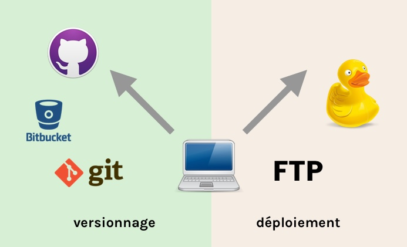

## Concept du versionnage

Le principe fondamental de Git est d'offrir un système de **versionnage** (gestion des versions), permettant de suivre de manière extrêmement précise chaque étape dans l'évolution d'un projet.

Pour illustrer cela, voici la visualisation du développement d'une fonte typographique, *[Steps Mono](https://velvetyne.fr/fonts/steps-mono/)*, créée par Raphaël Bastide et Jean-Baptiste Morizot pour le magazine *étapes*:

### Versionnage vs. déploiement

Dans le domaine du développement web, Git est souvent utilisé pour la **collaboration** et le **versionnage** du code d'un site. 

Il est parfois utilisé comme **outil de déploiement** (envoi du code finalisé vers le serveur public), mais pas toujours. Les services d'hébergement web ne supportent pas toujours les protocoles nécessaires (SSH+Git).

On peut donc très bien avoir des processus hybrides:

* **Git** est utilisé pour la collaboration et l'archivage du code (versionnage).
* **FTP ou SFTP** est utilisé pour publier le code vers le serveur public (déploiement).
* **Netlify** est un système d'hébergement en vogue, surtout pour des sites statiques (voir [CMS statiques](https://cours-web.ch/wp/similaires/#les-cms-en-fichiers-statistiques)). Il permet un déploiement depuis GitHub.

