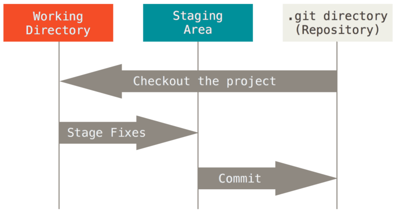
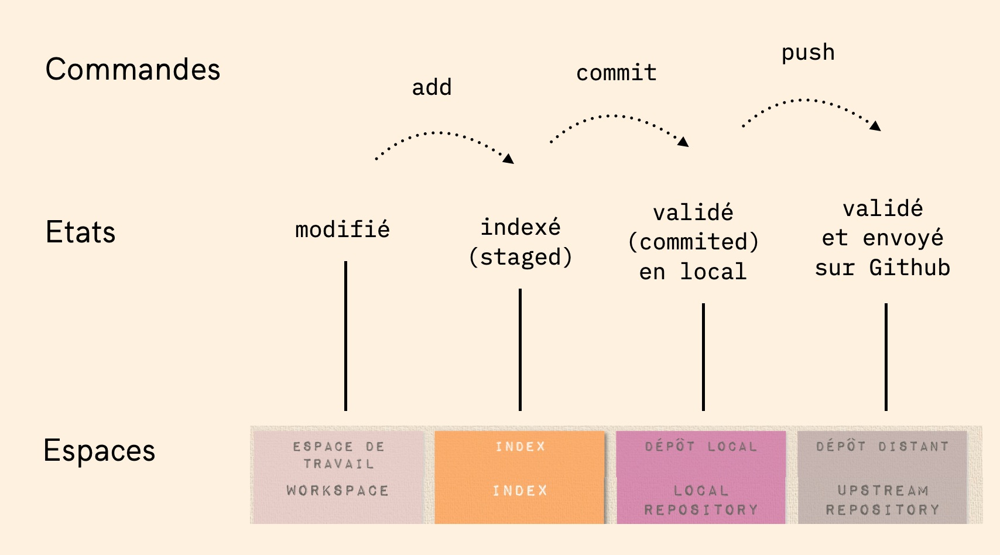

## Comment fonctionne Git ?

Git est un logiciel pouvant fonctionner en ligne de commande, on lui "parle" en utilisant des commandes, telles que `pull`, `push`, `clone`, `add`, `commit`...

Le principe: 

1. En utilisant des commandes Git, on enregistre des "snapshots" qui conservent l'état du projet à un point précis.
2. On synchronise les modifications locales avec un serveur distant. Git s'occupe de fusionner les modifications.

### La notion de commit

La commande **git commit** est centrale dans Git: c'est cette commande qui crée un nouvel "instantané" de l'état de votre projet, dans son intégralité. 

Comme le dit David Demaree dans *Git for Humans*: 

- Un commit enregistre les modifications apportées aux fichiers figurant dans la base de données de Git: il indique par exemple qu'un fichier est passé de la version A à la version B.
- Chaque commit est autonome: il ne référence pas seulement ce qui a changé, mais aussi tout ce qui compose l'état de votre projet à un moment donné.

### Les états des fichiers

Le livre "*[Pro Git](https://git-scm.com/book/fr/v2)*" donne une bonne explication des "trois états" dans lesquels peuvent se trouver les fichiers:

Git gère **trois états** dans lesquels les fichiers peuvent résider : `modifié`, `indexé` et `validé`.

- **Modifié** (*Modified*) signifie que vous avez modifié le fichier mais qu’il n’a pas encore été validé (*committed*).
- **Indexé** (*Staged*) signifie que vous avez marqué un fichier modifié dans sa version actuelle pour qu’il fasse partie du prochain instantané du projet.
- **Validé** (*Committed*) signifie que les données sont stockées en sécurité dans votre base de données locale.

Ceci nous mène aux **trois sections principales** d’un projet Git : le **répertoire de travail** (*working directory*), la **zone d’index** (*staging area*) et le **répertoire Git** (*Git directory*).

- Le **répertoire de travail** (*working tree* ou *working directory*) : votre espace de travail, sur votre ordinateur. En langage Git: "c'est une extraction unique d’une version du projet. Ces fichiers sont extraits depuis la base de données compressée dans le répertoire Git et placés sur le disque pour pouvoir être utilisés ou modifiés". 
- La **zone d’index** (*staging area*). On l’appelle aussi des fois la zone de préparation. On y ajoute des fichiers avec la commande "git add": ils sont désormais indexés. Cette zone stocke tout ce qui fera partie du prochain instantané (commit). La zone d'index n'est pas synchronisée ni partagée, elle n'existe que sur votre ordinateur.
- Le **répertoire Git** (*Git directory*) est l’endroit où Git stocke les méta-données et la base de données des objets de votre projet. C’est la partie la plus importante de Git, et c’est ce qui est copié lorsque vous clonez un dépôt depuis un autre ordinateur.

On pourrait encore ajouter deux sections:

- Le **répertoire Git distant** (remote): il s'agit du serveur, par exemple sur Github (ou Gitlab, Framagit). 
- Le **stash** : des modifications "mises de côté". Permet de sauvegarder temporairement des changements apportés à votre copie de travail pour que vous puissiez effectuer d'autres tâches, puis revenir et les réappliquer par la suite.

L’utilisation standard de Git se passe comme suit :

1. vous modifiez des fichiers dans votre répertoire de travail (état = modifié).
2. vous **indexez** (*stage*) les fichiers modifiés, ce qui ajoute des instantanés de ces fichiers dans la zone d’index (état = indexé).
3. vous **validez** (*do a commit*), ce qui a pour effet de basculer les instantanés des fichiers de l’index dans la base de données du répertoire Git (état = validé).
