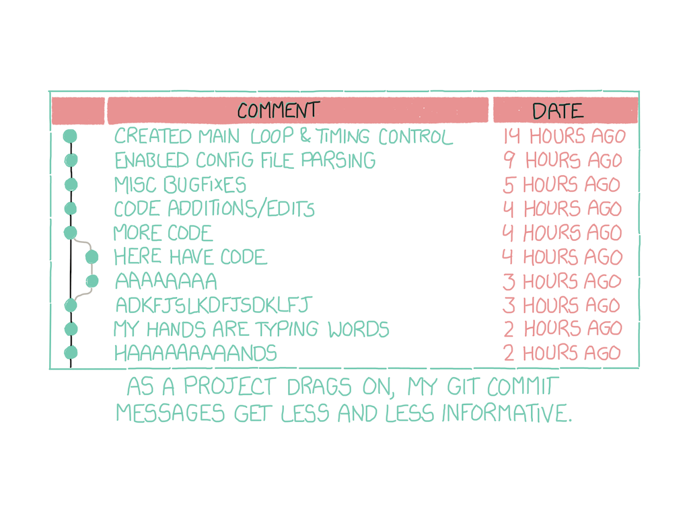

> **Commit** : C’est la commande qui donne à Git toute sa puissance. Quand vous « committez », vous prenez un « instantané », une « photo » de votre dépôt à ce stade, vous donnant un point de contrôle que vous pouvez ensuite réévaluer ou restaurer votre projet à un état précédent. – Christophe Ducamp, *[Github pour les nuls](https://www.christopheducamp.com/2013/12/15/github-pour-nuls-partie-1/)*


### Ecriture de messages de Commit

"En règle générale, les messages doivent débuter par une ligne unique d’au plus 50 caractères décrivant concisément la modification, suivie d’une ligne vide, suivie d’une explication plus détaillée. Le projet Git exige que l’explication détaillée inclue la motivation de la modification en contrastant le nouveau comportement par rapport à l’ancien — c’est une bonne règle de rédaction."

Source: [The Git Book](https://git-scm.com/book/fr/v2/Git-distribu%C3%A9-Contribution-%C3%A0-un-projet)


Source: *[Git for Humans](https://speakerdeck.com/alicebartlett/git-for-humans)*, conférence par Alice Bartlett, développeuse au *Financial Times* - aussi disponible [en vidéo](https://www.youtube.com/watch?v=eWxxfttcMts).

"Un message de commit bien conçu doit clarifier la raison d'une modification. Git permet de voir facilement *ce qui* a changé, mais seul un bon message de commit peut expliquer *pourquoi*."


### Conventions d'écriture

Il existe des "conventions d'écriture" qui visent à harmoniser les manières d'écrire les messages.

L'une de ces conventions se nomme, de manière très originale, "Commits Conventionnels": [https://www.conventionalcommits.org/fr/v1.0.0/](https://www.conventionalcommits.org/fr/v1.0.0/)

Voici le modèle proposé: 

```
<type>[optional scope]: <description>

[optional body]

[optional footer(s)]
```

### Autres bonnes pratiques

L'écriture de messages de commit est l'une des méthodes permettant d'avoir un historique lisible et structuré. Ces bonnes pratiques, qui tout d'abord apparaissent comme une perte de temps, deviendront une habitude, et augmenteront la productivité de toutes les parties prenantes.

### Les sept règles du bon commit

En 2014, Chris Beams définit sept règles pour l'écriture d'un bon commit, dans son article "*[How to Write a Git Commit Message](https://cbea.ms/git-commit/)*":

1. Le sujet doit être séparé du message par une ligne vide.
2. Le sujet doit être limité à 50 caractères.
3. La première lettre prend une majuscule.
4. Ne pas terminer le sujet par un point.
5. Utiliser le présent (ou l'impératif si on écrit en anglais).
6. Faire des retours de ligne au-delà de 72 caractères.
7. Le message doit expliquer le *pourquoi*.

Quelle forme verbale utiliser? **L'impératif** est recommandé pour l'anglais. Le message du commit devrait compléter la phrase *"If applied, this commit will..."*.

- If applied, this commit will *update getting started documentation*
- If applied, this commit will *remove deprecated methods*

En appliquant cette logique au français, la forme verbale doit être **le présent**. Le message doit répondre à la question: *"Ce commit..."*. Exemples:

- Ce commit *complète la documentation*
- Ce commit *simplifie la structure du CSS*
- Ce commit *supprime des images non-utilisées*

### Ce qu'il ne faut pas faire

Cette bande-dessinée de xkcd montre un exemple de commentaires Git mal utilisés: ils expriment le désespoir d'un développeur, mais n'indiquent pas le but des modifications, et n'ont finalement aucune utilité.



Source: [https://xkcd.com/1296/](https://xkcd.com/1296/)