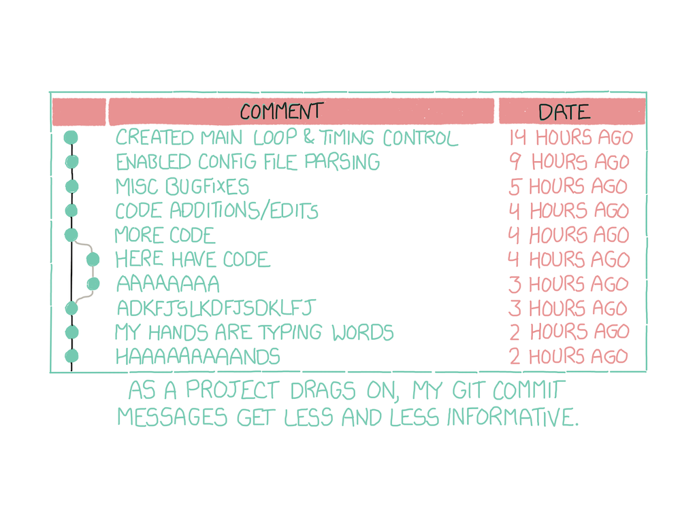

> **Commit** : C’est la commande qui donne à Git toute sa puissance. Quand vous « committez », vous prenez un « instantané », une « photo » de votre dépôt à ce stade, vous donnant un point de contrôle que vous pouvez ensuite réévaluer ou restaurer votre projet à un état précédent. – Christophe Ducamp, *[Github pour les nuls](https://www.christopheducamp.com/2013/12/15/github-pour-nuls-partie-1/)*

Source: [https://xkcd.com/1296/](https://xkcd.com/1296/)

### Ecriture de messages de Commit

"En règle générale, les messages doivent débuter par une ligne unique d’au plus 50 caractères décrivant concisément la modification, suivie d’une ligne vide, suivie d’une explication plus détaillée. Le projet Git exige que l’explication détaillée inclue la motivation de la modification en contrastant le nouveau comportement par rapport à l’ancien — c’est une bonne règle de rédaction."

Source: [The Git Book](https://git-scm.com/book/fr/v2/Git-distribu%C3%A9-Contribution-%C3%A0-un-projet)

Source: *[Git for Humans](https://speakerdeck.com/alicebartlett/git-for-humans)*, conférence par Alice Bartlett, développeuse au *Financial Times* - aussi disponible [en vidéo](https://www.youtube.com/watch?v=eWxxfttcMts).

