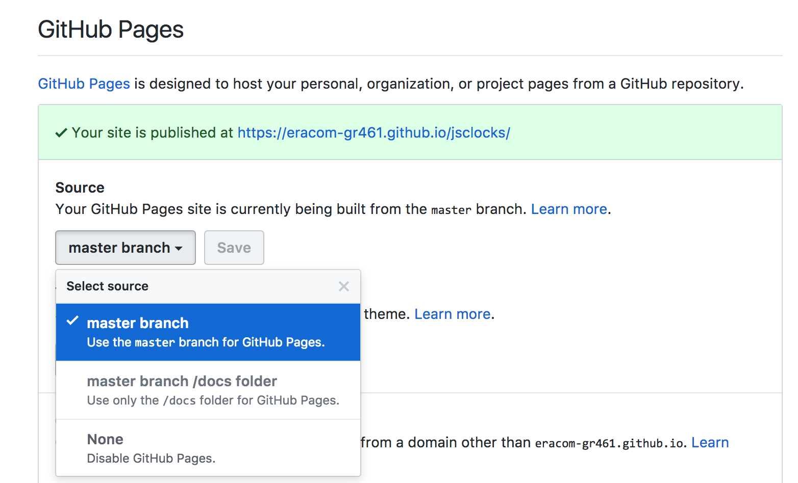
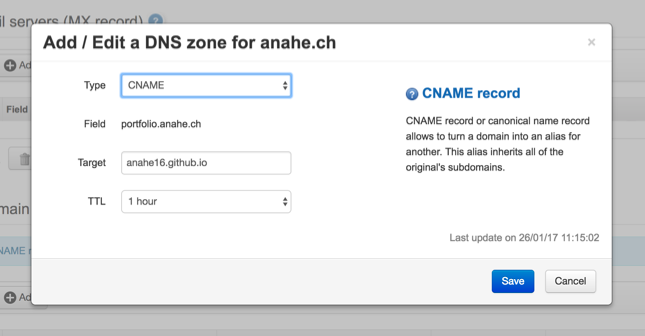
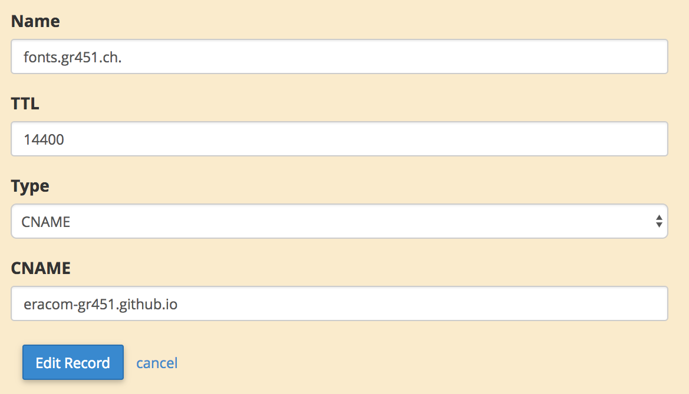
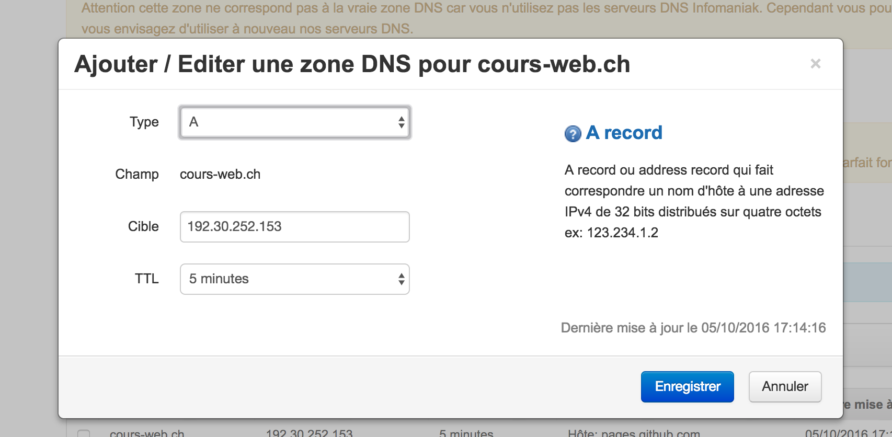
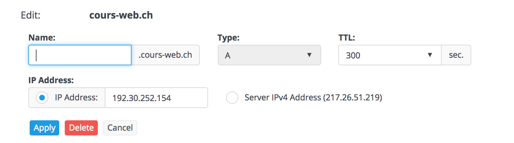
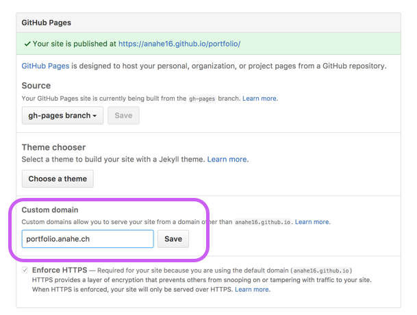

GitHub offre une fonctionalité gratuite, **GitHub Pages**, qui permet de publier un site web à partir d'un projet GitHub.

Voici la marche à suivre:

- Sur la page de votre projet Github, cliquez sur l'onglet *Settings*.
- Scrollez vers le bas, dans la partie "Github Pages"
- Sous "Source", choisir la branche à utiliser (en principe "main").
- Laisser vide le champ "Custom domain".
- Enregistrer ("Save").

Vous verrez un message indiquant "Your site is published at https://(utilisateur).github.io/(projet)/"

Si vous visitez la page immédatement, il est possible que vous ayez pendant les premières minutes une page d'erreur... Attendez un peu, le temps que votre site soit généré.

Note: votre adresse web GitHub Pages affichera automatiquement le fichier index.html situé à la base de votre projet. Vous pouvez aussi atteindre d'autres fichiers, en ajoutant leur nom à la fin de l'URL.

## Utiliser GitHub Pages avec votre propre nom de domaine

Vous souhaitez utiliser votre propre nom de domaine, au lieu du "utilisateur.github.io/nom-du-projet" qui sera produit par GitHub? C'est possible!

Vous devez pour cela faire une configuration auprès du Registrar, chez qui vous avez acheté le nom de domaine. 

### Réglages à faire dans l'administration DNS de votre Registrar

- Décidez quel nom de domaine vous souhaitez utiliser. 
- Rendez-vous dans la gestion des zones DNS de votre registrar (chez Infomaniak ou autre).
- Pour trouver cet endroit chez Infomaniak, connectez-vous à [manager.infomaniak.com](https://manager.infomaniak.com/), allez dans : *Nom de domaine > Nom de votre domaine > Gestion des DNS*, puis cliquez le bouton "Gérer les zones DNS".

**Option sous-domaine:**

- Si le domaine comporte un sous-domaine, comme **portfolio.example.com**, ou **www.example.com**, vous devrez créer une entrée de type CNAME.
- Renseignez "Champ/Field" (entrer le sous-domaine choisi), et "Cible/Target" (username.github.io). Si votre utilisateur est p.ex. Mafalda, vous entrerez : mafalda.github.io (tout en minuscules).
- Vous pouvez laisser le champ TTL avec sa valeur par défaut.

**Option "apex domain":**

- Si le domaine est dépourvu de sous-domaine, comme **cours-web.ch** (un "apex domain"), la procédure est différente. Il faudra créer deux entrées de type A.
- Renseignez "Cible" et entrez les adresses IP [fournies par GitHub dans leur documentation](https://help.github.com/articles/setting-up-an-apex-domain/), à savoir 192.30.252.153 et 192.30.252.154 (une pour chaque entrée A).
- Vous pouvez laisser le champ TTL avec sa valeur par défaut.

PS: le réglage d'adresse IP sera différent pour d'autres services web. P.ex. pour un domaine Tumblr, l'adresse IP sera 66.6.44.4.

### Réglages à faire dans GitHub

- Premièrement, votre projet doit être publié sur GitHub.
- Aller dans les "Settings" de votre projet, dans la partie "Github Pages"
- Sous "Source", choisir la branche à utiliser.
- Sous "Custom domain", renseigner le domaine, p.ex. portfolio.example.com
- Enregistrer ("Save") - ça y est, votre site fonctionne!

Note: initialement il était nécessaire de créer une branche nommée "gh-pages", mais ce [n'est plus nécessaire depuis août 2016](https://github.com/blog/2228-simpler-github-pages-publishing), on peut désormais aussi utiliser la branche "main".

**Documentation de GitHub Pages:** 

* [Using a custom domain with GitHub Pages](https://help.github.com/articles/using-a-custom-domain-with-github-pages/)
* [About supported custom domains](https://help.github.com/articles/about-supported-custom-domains/)
* [Setting up an apex domain](https://help.github.com/articles/setting-up-an-apex-domain-and-www-subdomain/)

### Activer HTTPS pour votre domaine

Depuis 2016-2017, il est devenu crucial de servir les sites avec le protocole sécurisé HTTPS. Sur GitHub Pages, cela est automatiquement le cas si on utilise le domaine par défaut (github.io), mais pas avec un nom de domaine personalisé (Github ne proposant pas de certificat SSL pour ces domaines).

Pour activer le support du HTTPS, il existe actuellement (état: fin 2017) une méthode consistant à recourir au service CloudFlare. Ce service DNS intermédiaire (qui propose principalement des foncionalités de cache et de protection contre les cyberattaques) permet d'avoir gratuitement un certificat SSL qui fonctionne pour un site Github. La technique [est documentée sur cette page](https://gist.github.com/cvan/8630f847f579f90e0c014dc5199c337b).

C'est la méthode utilisée pour le site cours-web.ch, qui est hébergé avec GitHub Pages.
