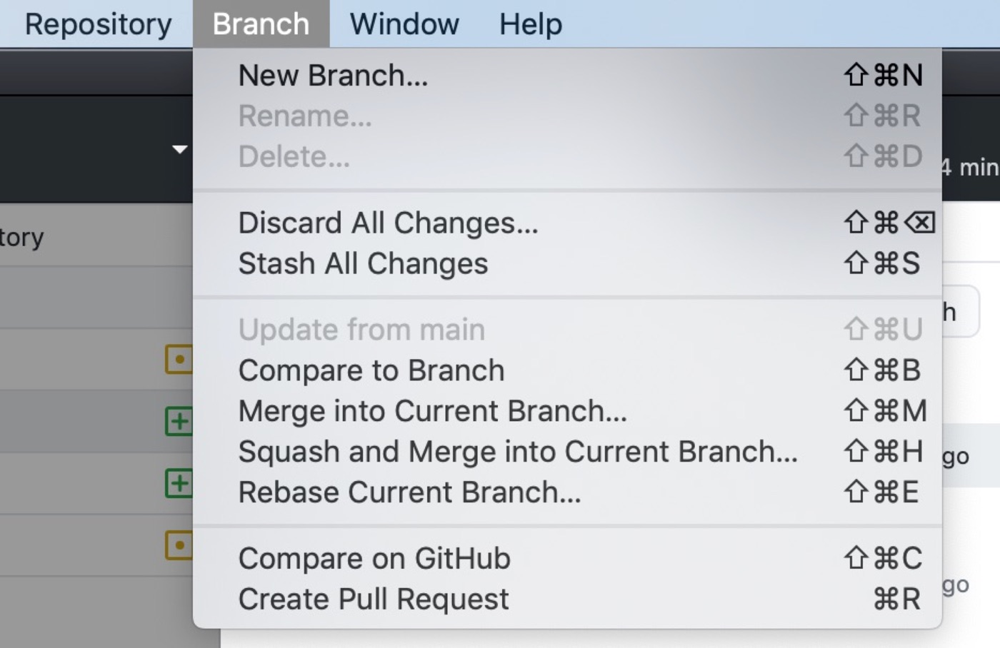
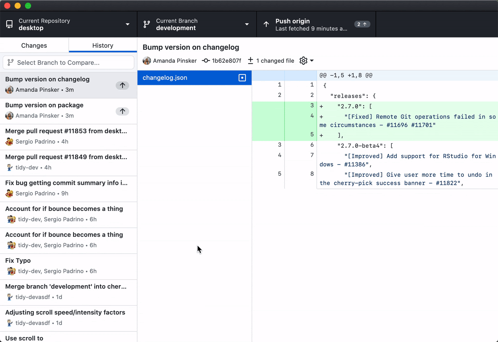

# Les branches

Le système des **branches** est une fonctionnalité puissante, qui permet de sortir d'un processus d'avancement linéaire, et de créer au sein d'un projet des "bifurcations", voire une arborescence.

Cela permet par exemple de créer une version alternative et expérimentale, pour tester de nouvelles fonctionalités.

Ces ajouts, qui peuvent introduire des dysfonctionnements, ne vont pas perturber la version de base (généralement nommée "main"), qui reste ainsi stable.

Une fois qu'un développement expérimental arrive à maturité, on peut l'intégrer dans la version de base. On fera cela en fusionnant la branche expérimentale avec la branche "main", en faisant appel à la fonction "merge".

## Fonctions dans l'interface Github Desktop

Dans Github Desktop, le menu "Branch" propose différentes fonctions permettant d'agir sur les branches.

`cherry-pick` : cette fonction permet de sélectionner un ou plusieurs commits, et de les ajouter à une autre branche. En faisant un click-droit sur un commit dans l'historique, choisir "Cherry-pick Commit...". Il est possible de le faire par un glisser-déposer:

`squash` : cette fonction permet de fusionner plusieurs commits pour n'en faire qu'un seul. C'est une manière de "nettoyer" l'historique du projet, pour le rendre plus lisible. Ainsi, une suite de commits avec un même objectif pourront être groupés.

*Amend last commit* : permet d'ajouter les modifications au commit le plus récent. Par exemple, quand on rajoute un petit correctif qui ne mérite pas de faire l'objet d'un commit.

`stash`: cette fonction permet de "mettre dans une cachette" les modifications qui n'ont pas été commitées. On la trouve dans le menu *Branch > Stash All Changes*.

**Create Branch from Commit** : permet de créer une nouvelle branche à parir d'un ancien commit, dans l'historique du projet.

## Merge

(à documenter)

## Pull Request

(à documenter)

## Documentation sur les branches

* Explicatif des branches dans l'interface SourceTree: [Use SourceTree branches to merge an update](https://confluence.atlassian.com/bitbucket/use-sourcetree-branches-to-merge-an-update-732268925.html)