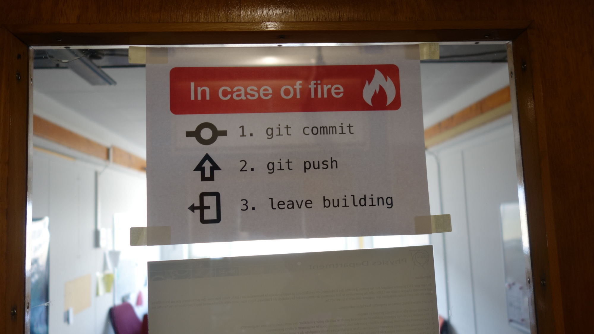

Un workflow Git
===

Une méthodologie Git pour projets de design, proposée par [Mathieu Dutour](https://mathieudutour.github.io/git-sketch-plugin/), auteur du *Git Sketch Plugin*:

* Créez une nouvelle *branche* quand vous commencez à travailler sur une nouvelle fonctionalité.
* Travaillez normalement sur votre design.
* Enregistrez le fichier.
* Faites un "Commit" de vos modifications, avec un message les décrivant.
* Faites un "Push" de vos modifications.
* Faites une "pull request" de votre branche vers la branche principale ("main").
* Voilà! Vos collaborateurs peuvent voir vos modifications, faire des commentaires, et les approuver. Une fois approuvés, faire un "merge" de votre "pull request".

{:id: .large-image}

### Mettre à jour une branche

En utilisant les branches pour travailler sur des fonctionalités précises ("feature-branch"), il est parfois nécessaires de récupérer les nouveaux commits survenus dans la branche "main".

Voici comment le faire en ligne de commande:

 * S'assurer qu'on est dans la branche de fonctionalité : ``git checkout <feature-branch>``
 * Appliquer les updates de "main" : `git merge main`

Voici comment le faire avec SourceTree:

* Cliquer sur le bouton "Merge" (ou via le menu: *Repository > Merge...*)
* Choisir "Merge Fetched" et préciser: *Merge from fetched remote branch: origin/main*.

### Fusionner une branche locale avec Main

Vous avez achevé vos travaux dans la branche "feature-branch", et vous souhaitez faire entrer vos modifications dans la branche principale.

Voici la technique en ligne de commande:

```
git checkout main
git pull origin main
git merge feature-branch
git push origin main
```

Voici la technique avec SourceTree:

- Passez à la branche Main (double-clic).
- Clic-droit sur la branche de fonctionalité, choisir "Merge feature-branch into main".
- Dans la fenêtre confirm merge, cliquer "OK".

### Liens sur les workflows Git

Au fil du temps, après que l'utilisation de GitHub dans le domaine du développement et du web se soit popularisé, différentes méthodologies de "gestion de projet Git" ont émergé. Voici quelques articles qui décrivent des méthodes d'organisation:

<div class="cards"></div>

* [A successful Git branching model](http://nvie.com/posts/a-successful-git-branching-model/) - article de Vincent Driessen, 2010, définissant la méthodologie "Git Flow". Propose un système de branches.
* [Using git-flow to automate your git branching workflow](http://jeffkreeftmeijer.com/2010/why-arent-you-using-git-flow/) - par Jeff Kreeftmeijer. Donne des informations techniques sur la manière d'appliquer le modèle "Git Flow" (et l'utilitaire git-flow, qui est "a wrapper around existing git commands").
* [GitHub Flow](http://scottchacon.com/2011/08/31/github-flow.html) - article de  Scott Chacon, 2011. Décrit une méthode plus simple et fluide (pratiquée par l'entreprise GitHub, d'où son nom).
* [A simple git branching model](https://gist.github.com/jbenet/ee6c9ac48068889b0912) - par Juan Benet, 2013.
* [Simple Git workflow is simple](http://blogs.atlassian.com/2014/01/simple-git-workflow-simple/) - article de Nicola Paolucci, 2014.
* [GitLab Flow](https://about.gitlab.com/2014/09/29/gitlab-flow/) - article de Sytse Sijbrandij, 2014. Propose une version simplifiée de Git Flow: "git flow is too complex for most of the use cases".
* [Comparing Workflows](https://www.atlassian.com/git/tutorials/comparing-workflows) - documentation d'Atlassian (la société produisant Bitbucket et Sourcetree)

Quelques autres articles sur l'utilisation de Git:

- [Bien utiliser Git merge et rebase](https://delicious-insights.com/fr/articles/bien-utiliser-git-merge-et-rebase/) - par Christophe Porteneuve (git-attitude), 2014


