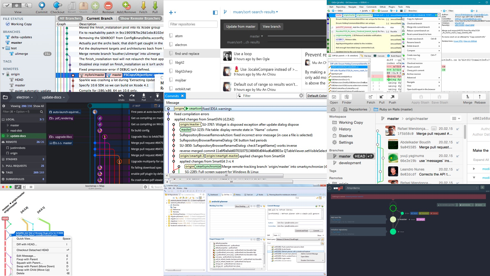

Quelques logiciels pour utiliser Git à travers une interface graphique (en alternative à la ligne de commande):

- [GitHub Desktop](https://desktop.github.com/), client Git (Mac et Windows) développé par GitHub.
- [SourceTree](https://www.sourcetreeapp.com/), client Git (Mac et Windows) développé par Atlassian (société proposant le service BitBucket).
- [GitKraken](https://www.gitkraken.com/), "Free for open source, education, non‑profit, startups or personal use".
- [SmartGit](http://www.syntevo.com/smartgit/ ), "can be used free of charge by Open Source developers, teachers and their students, or for hobby, non-paid usage."

Il en existe des dizaines, qui sont repertoriés [sur le site git-scm](https://git-scm.com/download/gui/mac).

Pour les amateurs de la ligne de commande, voici un utilitaire permettant d'utiliser les commandes Git en français:

- [gitconfig, par Rémi Prévost](https://gist.github.com/remiprev/1110021)